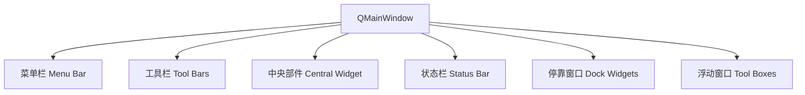

MainWindow

在 Qt 框架中，**`QMainWindow`** 是用于创建**应用程序主窗口**的核心类（继承自 `QWidget`），它提供了一个标准化的窗口框架，包含菜单栏、工具栏、状态栏、中央部件、停靠窗口等组件，是开发桌面应用程序（如编辑器、IDE、工具软件）的基础。

### 一、`QMainWindow`的核心定位

- 

  **主窗口容器**：作为应用程序的“主界面”，承载其他功能组件（如中央编辑区、侧边栏、工具栏等）。

- 

  **标准化框架**：内置菜单栏、工具栏、状态栏等标准 UI 元素，无需手动布局，开箱即用。

- 

  **灵活扩展**：支持中央部件替换、停靠窗口（Dock Widgets）浮动/吸附、工具栏位置调整等高级布局。

### 二、`QMainWindow`的核心组件（结构）

一个典型的 `QMainWindow`包含以下部分（按区域划分）：



#### 1. **菜单栏（Menu Bar）**

- 

  **位置**：窗口顶部（默认隐藏，需手动创建）。

- 

  **作用**：包含多个**菜单（QMenu）**，每个菜单下有**动作（QAction）**（如“新建文件”“保存”“退出”）。

- 

  **特点**：支持多级子菜单、快捷键（如 `Ctrl+S`）、图标和分隔线。

  **示例代码**：

  ```cpp
  // 创建菜单栏
  QMenuBar* menuBar = this->menuBar();  // 获取主窗口菜单栏（不存在则自动创建）
  
  // 添加“文件”菜单
  QMenu* fileMenu = menuBar->addMenu("文件(&F)");  // &F 表示快捷键 Alt+F
  
  // 添加动作到菜单
  QAction* newAct = fileMenu->addAction(QIcon(":/res/new.png"), "新建(&N)");
  newAct->setShortcut(QKeySequence::New);  // 设置快捷键 Ctrl+N
  connect(newAct, &QAction::triggered, this, &MainWindow::onNewFile);
  ```

#### 2. **工具栏（Tool Bars）**

- 

  **位置**：菜单栏下方或窗口边缘（可拖动调整位置，支持浮动）。

- 

  **作用**：将常用动作（QAction）以图标按钮形式集中展示，提高操作效率。

- 

  **特点**：支持添加分隔线、设置图标大小、锁定位置（`setMovable(false)`）。

  **示例代码**：

  ```cpp
  // 创建工具栏
  QToolBar* toolBar = addToolBar("文件");  // 添加工具栏并命名
  
  // 添加动作（复用菜单中的 newAct）
  toolBar->addAction(newAct);
  toolBar->addSeparator();  // 添加分隔线
  toolBar->addAction(saveAct);  // 保存动作
  ```

#### 3. **中央部件（Central Widget）**

- 

  **位置**：窗口中心区域（唯一且必须设置）。

- 

  **作用**：承载核心功能界面（如文本编辑器、图像显示区、列表控件等），是用户交互的主要区域。

- 

  **特点**：可替换为任意 `QWidget`派生类（如 `QTextEdit`、`QTabWidget`、`QSplitter`）。

  **示例代码**：

  ```cpp
  // 设置中央部件（文本编辑器）
  QTextEdit* textEdit = new QTextEdit(this);
  this->setCentralWidget(textEdit);  // 中央部件必须是 QWidget*
  ```

#### 4. **状态栏（Status Bar）**

- 

  **位置**：窗口底部。

- 

  **作用**：显示临时消息（如“就绪”“文件已保存”）、永久信息（如版权）或进度条。

- 

  **特点**：支持临时消息（`showMessage`）、永久标签（`addPermanentWidget`）、消息自动消失（`timeout`）。

  **示例代码**：

  ```cpp
  // 获取状态栏（不存在则自动创建）
  QStatusBar* statusBar = this->statusBar();
  
  // 显示临时消息（3秒后消失）
  statusBar->showMessage("欢迎使用编辑器", 3000);
  
  // 添加永久标签（如版本号）
  QLabel* versionLabel = new QLabel("v1.0.0", this);
  statusBar->addPermanentWidget(versionLabel);
  ```

#### 5. **停靠窗口（Dock Widgets）**

- 

  **位置**：可吸附在窗口边缘（左、右、上、下）或浮动为独立窗口。

- 

  **作用**：放置辅助功能面板（如“文件浏览器”“属性编辑器”“控制台输出”）。

- 

  **特点**：支持拖动调整大小、折叠/展开、关闭（可设置 `setFeatures`禁用关闭）。

  **示例代码**：

  ```cpp
  // 创建停靠窗口（文件浏览器）
  QDockWidget* dockWidget = new QDockWidget("文件浏览器", this);
  QTreeView* treeView = new QTreeView(dockWidget);  // 树形视图作为内容
  dockWidget->setWidget(treeView);
  
  // 添加到主窗口右侧（可吸附）
  this->addDockWidget(Qt::RightDockWidgetArea, dockWidget);
  ```

#### 6. **浮动窗口（Tool Boxes）/ 对话框**

- 

  非核心组件，可通过 `QToolBox`（标签页式）或 `QDialog`（模态/非模态对话框）实现，通常作为中央部件或停靠窗口的内容。

### 三、`QMainWindow`的常用方法与信号

#### 核心方法（API）

| 方法                                              | 作用                               |
| ------------------------------------------------- | ---------------------------------- |
| `setCentralWidget(QWidget*)`                      | 设置中央部件（必须调用，否则空白） |
| `menuBar()`                                       | 获取菜单栏（不存在则创建）         |
| `addToolBar(QToolBar*)`                           | 添加工具栏                         |
| `statusBar()`                                     | 获取状态栏（不存在则创建）         |
| `addDockWidget(Qt::DockWidgetArea, QDockWidget*)` | 添加停靠窗口到指定区域             |
| `setWindowTitle(const QString&)`                  | 设置窗口标题                       |
| `setWindowIcon(const QIcon&)`                     | 设置窗口图标                       |

#### 核心信号

| 信号                                 | 触发时机       |
| ------------------------------------ | -------------- |
| `destroyed(QObject*)`                | 窗口被销毁时   |
| `windowTitleChanged(const QString&)` | 窗口标题改变时 |

