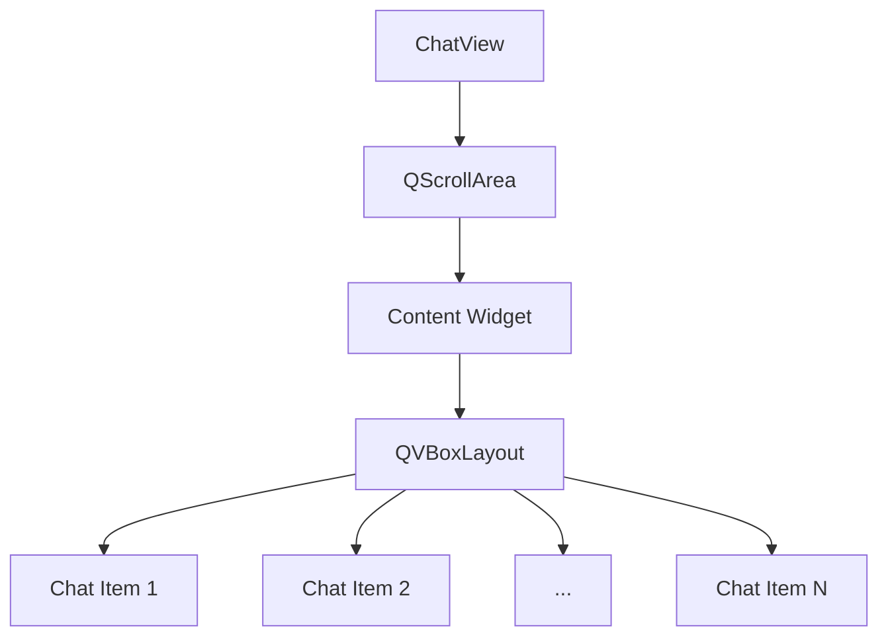

# QVBoxLayout 与 QScrollArea 深度解析

在 Qt 框架中，`QVBoxLayout`和 `QScrollArea`是两个核心组件，它们在构建用户界面时经常配合使用。下面我将详细解释它们的工作原理、协同关系以及在 `ChatView`类中的应用。

## QVBoxLayout（垂直布局）

### 基本概念

`QVBoxLayout`是 Qt 布局系统的核心组件之一，用于在垂直方向上排列子控件。

### 关键特性

| 特性         | 描述                           |
| ------------ | ------------------------------ |
| **方向**     | 垂直排列子控件（从上到下）     |
| **自动调整** | 自动调整子控件大小和位置       |
| **间距控制** | 可设置控件间垂直间距           |
| **边距控制** | 可设置布局边缘空白区域         |
| **拉伸因子** | 可设置控件在垂直方向的拉伸比例 |

### 核心方法

```cpp
// 添加控件
void addWidget(QWidget *widget, int stretch = 0, Qt::Alignment alignment = 0)

// 插入控件
void insertWidget(int index, QWidget *widget, int stretch = 0, Qt::Alignment alignment = 0)

// 移除控件
void removeWidget(QWidget *widget)

// 设置间距
void setSpacing(int spacing)

// 设置边距
void setContentsMargins(int left, int top, int right, int bottom)

// 设置拉伸因子
void setStretchFactor(QWidget *widget, int stretch)
```

### 在 ChatView 中的应用

```cpp
// 创建垂直布局
m_pVl = new QVBoxLayout(contentWidget);
m_pVl->setAlignment(Qt::AlignTop);  // 顶部对齐
m_pVl->setSpacing(10);              // 设置消息间距
m_pVl->setContentsMargins(5, 5, 5, 5); // 设置内边距
```

## QScrollArea（滚动区域）

### 基本概念

`QScrollArea`提供了一个可滚动的视图区域，当内容超出可视区域时自动显示滚动条。

### 关键特性

| 特性           | 描述                             |
| -------------- | -------------------------------- |
| **视口**       | 显示内容的可见区域               |
| **内容部件**   | 包含所有内容的容器部件           |
| **滚动条**     | 水平和垂直滚动条（可单独控制）   |
| **自动调整**   | 内容部件大小变化时自动调整       |
| **部件自适应** | 可设置内容部件是否随布局调整大小 |

### 核心方法

```cpp
// 设置内容部件
void setWidget(QWidget *widget)

// 设置内容部件是否自适应
void setWidgetResizable(bool resizable)

// 设置滚动条策略
void setHorizontalScrollBarPolicy(Qt::ScrollBarPolicy policy)
void setVerticalScrollBarPolicy(Qt::ScrollBarPolicy policy)

// 获取滚动条
QScrollBar *horizontalScrollBar() const
QScrollBar *verticalScrollBar() const

// 滚动到指定位置
void ensureVisible(int x, int y, int xmargin = 50, int ymargin = 50)
void ensureWidgetVisible(QWidget *childWidget, int xmargin = 50, int ymargin = 50)
```

### 在 ChatView 中的应用

```cpp
// 创建滚动区域
m_pScrollArea = new QScrollArea(this);
m_pScrollArea->setWidgetResizable(true); // 内容部件自适应
m_pScrollArea->setVerticalScrollBarPolicy(Qt::ScrollBarAsNeeded);
m_pScrollArea->setHorizontalScrollBarPolicy(Qt::ScrollBarAlwaysOff);

// 设置内容部件
QWidget *contentWidget = new QWidget;
m_pScrollArea->setWidget(contentWidget);

// 连接滚动条信号
connect(m_pScrollArea->verticalScrollBar(), &QScrollBar::valueChanged,
        this, &ChatView::onVScrollBarMoved);
```

## 协同工作原理

### 1. 层次结构



### 2. 布局流程

1. 

   创建内容部件（Content Widget）

2. 

   在内容部件上设置 QVBoxLayout

3. 

   将所有聊天项添加到 QVBoxLayout

4. 

   将内容部件设置为 QScrollArea 的 widget

5. 

   设置 QScrollArea 为 ChatView 的子控件

### 3. 大小调整机制

- 

  当添加/删除聊天项时：

  1. 

     QVBoxLayout 重新计算内容高度

  2. 

     内容部件高度相应变化

  3. 

     QScrollArea 检测到内容变化

  4. 

     更新滚动条范围

  5. 

     必要时显示/隐藏滚动条

### 4. 滚动同步

- 

  当用户滚动时：

  1. 

     QScrollArea 滚动条位置变化

  2. 

     触发 valueChanged 信号

  3. 

     调用 onVScrollBarMoved 槽函数

  4. 

     执行自定义滚动逻辑（如加载更多历史消息）

## 在 ChatView 中的完整实现

### 构造函数

```cpp
ChatView::ChatView(QWidget *parent) : QWidget(parent), isAppended(false)
{
    // 创建滚动区域
    m_pScrollArea = new QScrollArea(this);
    m_pScrollArea->setWidgetResizable(true);
    m_pScrollArea->setVerticalScrollBarPolicy(Qt::ScrollBarAsNeeded);
    m_pScrollArea->setHorizontalScrollBarPolicy(Qt::ScrollBarAlwaysOff);
    
    // 创建内容部件和布局
    QWidget *contentWidget = new QWidget;
    m_pVl = new QVBoxLayout(contentWidget);
    m_pVl->setAlignment(Qt::AlignTop);
    m_pVl->setSpacing(10);
    m_pVl->setContentsMargins(5, 5, 5, 5);
    
    // 添加伸缩因子使内容顶部对齐
    m_pVl->addStretch();
    
    // 设置滚动区域内容
    m_pScrollArea->setWidget(contentWidget);
    
    // 主布局
    QVBoxLayout *mainLayout = new QVBoxLayout(this);
    mainLayout->addWidget(m_pScrollArea);
    mainLayout->setContentsMargins(0, 0, 0, 0);
    
    // 初始化样式
    initStyleSheet();
    
    // 连接滚动条信号
    connect(m_pScrollArea->verticalScrollBar(), &QScrollBar::valueChanged,
            this, &ChatView::onVScrollBarMoved);
}
```

### 添加聊天项

```cpp
void ChatView::appendChatItem(QWidget *item)
{
    // 在stretch之前插入，使新消息在底部
    m_pVl->insertWidget(m_pVl->count() - 1, item);
    isAppended = true;
    
    // 自动滚动到底部（如果是新消息）
    if (isAppended) {
        QScrollBar *vbar = m_pScrollArea->verticalScrollBar();
        vbar->setValue(vbar->maximum());
    }
}

void ChatView::prependChatItem(QWidget *item)
{
    // 在开头添加（在stretch之前）
    m_pVl->insertWidget(0, item);
}

void ChatView::insertChatItem(QWidget *before, QWidget *item)
{
    int index = m_pVl->indexOf(before);
    if (index != -1) {
        // 在指定项之前插入
        m_pVl->insertWidget(index, item);
    } else {
        // 找不到则追加
        appendChatItem(item);
    }
}
```

### 滚动处理

```cpp
void ChatView::onVScrollBarMoved(int value)
{
    QScrollBar *vbar = m_pScrollArea->verticalScrollBar();
    int max = vbar->maximum();
    
    // 检测是否滚动到顶部（加载更多历史消息）
    if (value <= 0) {
        emit requestHistoryMessages();
    }
    
    // 检测是否滚动到底部
    isAppended = (value == max);
}
```

## 高级技巧与优化

### 1. 性能优化

```cpp
// 使用延迟更新避免频繁重绘
void ChatView::appendChatItem(QWidget *item)
{
    m_pVl->insertWidget(m_pVl->count() - 1, item);
    QTimer::singleShot(0, this, [this] {
        QScrollBar *vbar = m_pScrollArea->verticalScrollBar();
        vbar->setValue(vbar->maximum());
    });
}
```

### 2. 平滑动画

```cpp
// 平滑滚动到底部
void ChatView::scrollToBottom()
{
    QScrollBar *vbar = m_pScrollArea->verticalScrollBar();
    QPropertyAnimation *animation = new QPropertyAnimation(vbar, "value");
    animation->setDuration(300);
    animation->setStartValue(vbar->value());
    animation->setEndValue(vbar->maximum());
    animation->start(QAbstractAnimation::DeleteWhenStopped);
}
```

### 3. 动态加载

```cpp
// 滚动到顶部时加载更多历史消息
void ChatView::onVScrollBarMoved(int value)
{
    QScrollBar *vbar = m_pScrollArea->verticalScrollBar();
    if (value <= 0 && !loading) {
        loading = true;
        loadMoreHistory();
    }
}
```

### 4. 布局优化

```cpp
// 使用批处理减少布局计算次数
void ChatView::addMultipleItems(const QList<QWidget*>& items)
{
    m_pVl->blockSignals(true); // 暂时阻止信号
    
    for (auto* item : items) {
        m_pVl->insertWidget(m_pVl->count() - 1, item);
    }
    
    m_pVl->blockSignals(false); // 恢复信号
    updateGeometry(); // 手动触发布局更新
}
```

## 常见问题解决方案

### 1. 滚动条不出现

**原因**：内容部件大小未正确更新

**解决**：

```cpp
// 在添加/删除项目后调用
contentWidget->adjustSize();
```

### 2. 内容显示不全

**原因**：布局边距或间距设置不当

**解决**：

```cpp
// 检查并设置合适的边距
m_pVl->setContentsMargins(0, 0, 0, 0);
m_pVl->setSpacing(0);
```

### 3. 滚动性能差

**原因**：项目过多导致布局计算缓慢

**解决**：

```cpp
// 使用虚拟滚动技术
void ChatView::setVirtualScrollingEnabled(bool enable)
{
    if (enable) {
        // 只渲染可见项目
        viewport()->installEventFilter(this);
    }
}
```

### 4. 项目重叠

**原因**：布局未正确管理项目位置

**解决**：

```cpp
// 确保每个项目都有正确的尺寸策略
item->setSizePolicy(QSizePolicy::Expanding, QSizePolicy::Preferred);
```

## 最佳实践总结

1. 

   **布局层次清晰**：

   - 

     使用单独的 content widget 作为布局容器

   - 

     避免在滚动区域内直接使用顶级布局

2. 

   **内存管理**：

   ```cpp
   // 在析构函数中清理
   ChatView::~ChatView()
   {
       while (QLayoutItem* item = m_pVl->takeAt(0)) {
           delete item->widget();
           delete item;
       }
       delete m_pVl;
   }
   ```

3. 

   **响应式设计**：

   ```cpp
   // 处理窗口大小变化
   void ChatView::resizeEvent(QResizeEvent *event)
   {
       QWidget::resizeEvent(event);
       adjustLayoutForSize(width(), height());
   }
   ```

4. 

   **样式集成**：

   ```cpp
   void initStyleSheet()
   {
       setStyleSheet("QScrollArea { border: none; }"
                    "QWidget#contentWidget { background: #f0f2f5; }");
       contentWidget->setObjectName("contentWidget");
   }
   ```

通过深入理解 `QVBoxLayout`和 `QScrollArea`的工作原理及其协同关系，您可以创建出高效、流畅且用户友好的聊天视图组件，即使在处理大量消息时也能保持良好的性能表现。